# Grog — a modern platform for classic point-and-click adventures

Grog is a complete, self-contained platform for **making and shipping SCUMM-style
adventure games** (*Monkey Island*, *Day of the Tentacle*, *Indiana Jones and the
Fate of Atlantis*) with modern technology:

- **Grog Engine** — a zero-dependency JavaScript runtime. No build step, no
  compiler, no framework. If a device has a browser, it runs Grog games.
- **Grog Studio** — a browser-based authoring tool: room editor, walkable-area
  editor, pixel-art sprite editor, form-based action scripting, dialog trees,
  chiptune music editor, one-click playtest, one-click export.
- **Escape from the Engine Room** — a complete demo game that exercises every
  engine feature while affectionately roasting it, in the grand tradition of
  Monkey Island and DOTT.

| | |
|---|---|
| 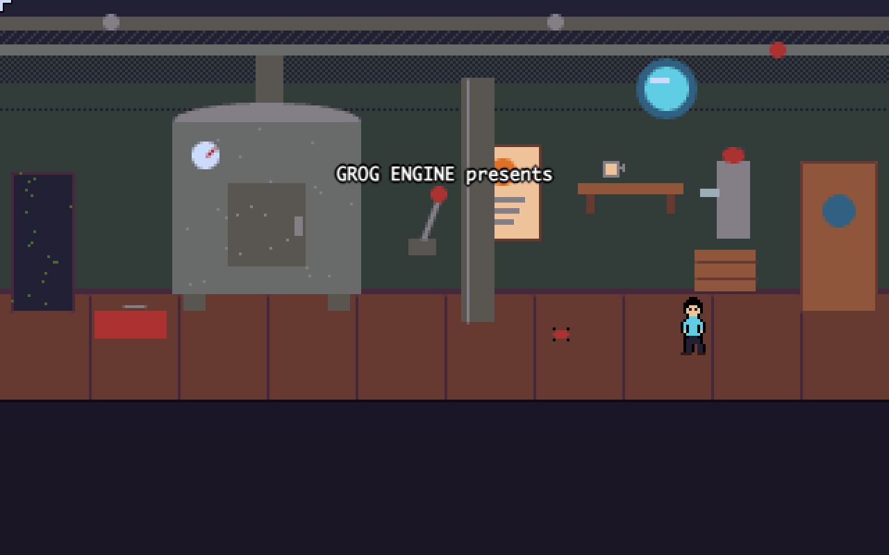 | 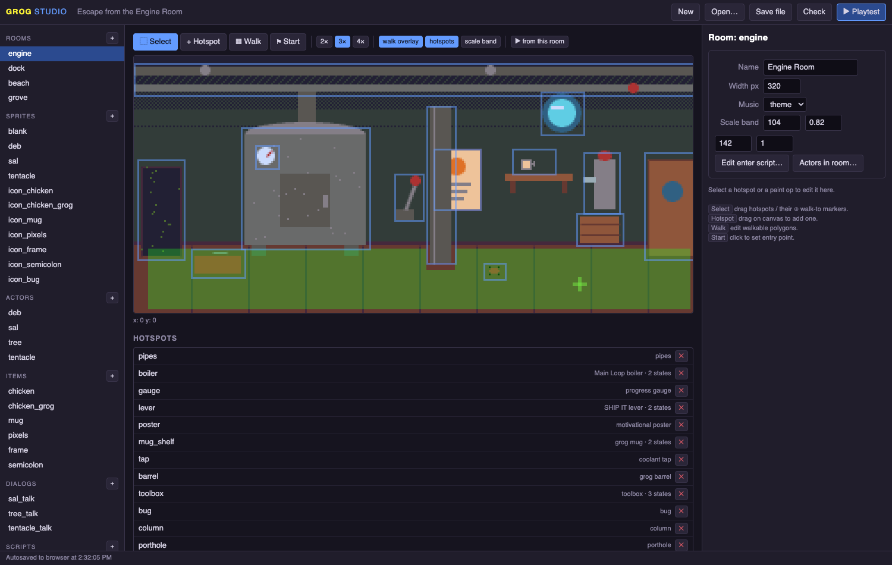 |
| The demo game (9-verb classic UI) | The same room open in Grog Studio |

## Quick start

```bash
# from this directory — any static file server works
python3 -m http.server 8000
```

- **Play the demo:** http://localhost:8000/play.html
- **Open the Studio:** http://localhost:8000/studio/ → “Load the demo game” or start blank

No install, no dependencies, nothing to compile. (A server is only needed for
development because browsers block `fetch` on `file://` — *exported* games are
single files that run from a double-click.)

## Why another engine? (the ScummVM lesson)

[ScummVM](https://github.com/scummvm/scummvm) keeps 35 years of adventures alive
with ~4M lines of C++ and a hand-written backend for every platform (SDL,
Dreamcast, 3DS…). Its deepest lesson — see [docs/RESEARCH.md](docs/RESEARCH.md) —
is that **games survive when they are data interpreted by a small, portable
runtime**. SCUMM games outlived every OS they shipped on because only the
interpreter ever needed porting.

Grog takes that lesson to its logical end: the runtime targets the one platform
that is already ported everywhere — the web. Porting story:

| Target | How | Effort |
|---|---|---|
| Web / itch.io | export a **single self-contained .html** | one click |
| Windows / macOS / Linux | exported **Electron** or **Tauri** (~4 MB) wrapper | one click + `npm start` / `cargo tauri build` |
| iOS / Android | exported **PWA** (installable, offline) | one click + any HTTPS host |
| A friend's laptop | send them the .html file | attach to email |

## Why authoring is easy

- **The whole game is one JSON file** — rooms, art, animation, scripts, dialogs,
  music. Diffable in git, hand-editable, no binary assets, no asset pipeline.
- **Art is data**: backgrounds are lists of paint ops (rects, polys, dithered
  gradients, seeded scatter); sprites are text grids of palette indices. Both are
  edited visually in Studio. PNG import (auto-quantized to the DB32 palette) also works.
- **Scripts are action lists**, built in a form UI — `say`, `walk`, `goto`,
  `give`, `if`, `random`… with a tiny condition language
  (`boiler_fueled && !has(rope) && v.coins >= 3`). Raw-JSON escape hatch everywhere.
- **Music is text**: `"C4 E4 G4 - . C5"` patterns played by a WebAudio chiptune
  synth. No audio files.
- **Instant playtest** in an overlay, including “▶ from this room”.
- **Project check** finds dangling references (rooms, items, dialogs, frames)
  before your players do.

## Two art pipelines, one platform

When you create a project, Grog Studio asks which **art pipeline** you want —
and every project can freely mix both:

| | Classic paint | Imported assets |
|---|---|---|
| Backgrounds | paint ops drawn in Studio | **PNG images** (any art tool, or AI-generated) |
| Characters | text-grid pixel sprites | **sprite sheets** sliced from PNGs |
| Objects / states | paint ops per state | image overlays per state |
| Stored as | JSON ops | data URIs inside the same JSON |

Imported images live *inside* the project JSON, so the single-file export never
breaks. The asset workflow: **Assets → + → import PNG** → “Set as background” /
“Create sheet sprite” (a numbered grid slicer names your animation frames) →
draw walk areas and hotspots over the image as usual. Full color — imported art
is not forced through the retro palette.

Proof: the second demo, **The Case of the Missing Pixel** — a one-room noir
mystery whose office background, trench-coat detective (Rae Tracer, P.I.) and
coffee mug were AI-generated, imported, chroma-keyed and sheet-sliced entirely
through this pipeline. Play it: `play.html?project=demo/missing-pixel.grog.json`.

| | |
|---|---|
| 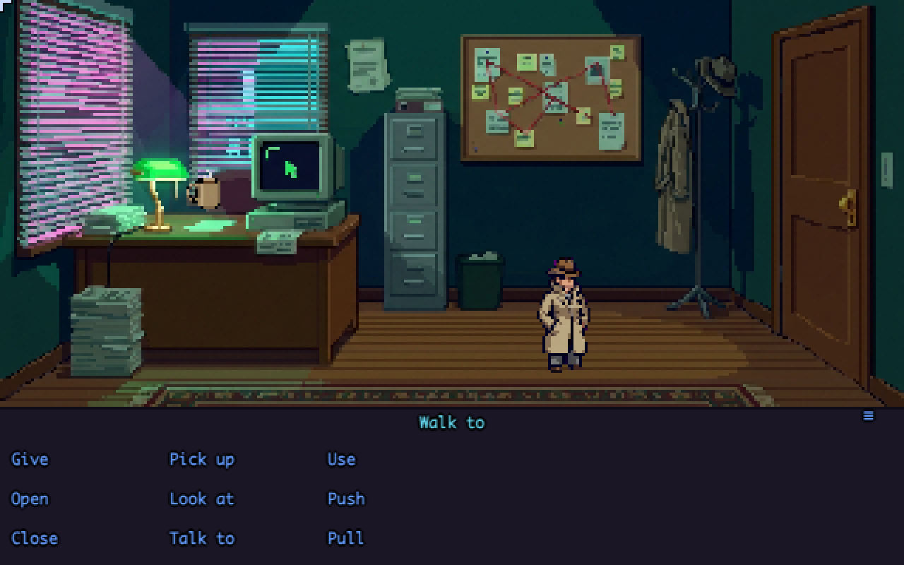 | 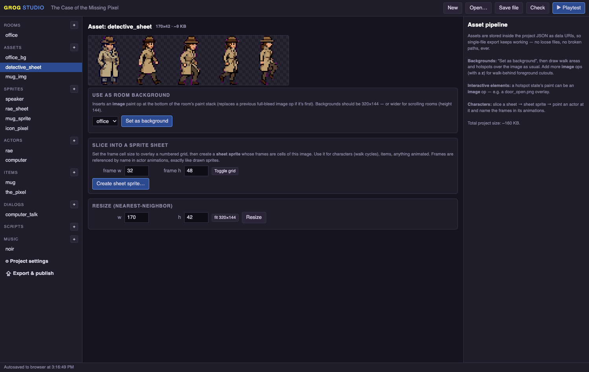 |
| Imported-asset demo (AI-generated art) | The asset editor: slice, resize, set-as-background |

## The flagship demo: a full investigation game from a story

**The Song of the Bearded Whalephant** (`demo/whalephant.grog.json`) adapts the
short story *La canción del ballenofante barbado* (Tharmathesis, 2026) into a
complete investigation adventure — and every piece of art in it was
AI-generated and imported through the Studio's asset pipeline (3 painted
backgrounds, a 5-frame character sheet, 4 creature/NPC sprites, 8 item icons).

Professor Tharma has slept for three days, smiling, unwakeable. Playing his
niece Marina, you work a real evidence chain: journal → key behind the star
chart → locked drawer → wax cylinder → the phonograph wakes *el artefacto* —
then follow his trail down into a prehistoric submarine jungle to interview
the only witnesses: Ictio the fisher ("went up like bubble — pop of light —
gone") and the Bearded Whalephant itself, who will teach you the rising verse…
once you do something about a thousand years of beard tangles. The finale is
investigation-gated dialog: you convince the professor's dream-self with the
clues you actually found, then escort him to the Threshold Dragon — because
being swallowed, it turns out, is simply how a dream lets you go.

| | |
|---|---|
| 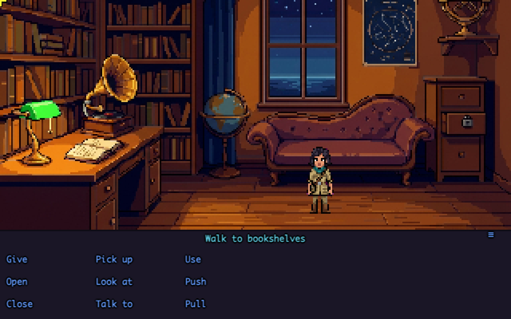 | 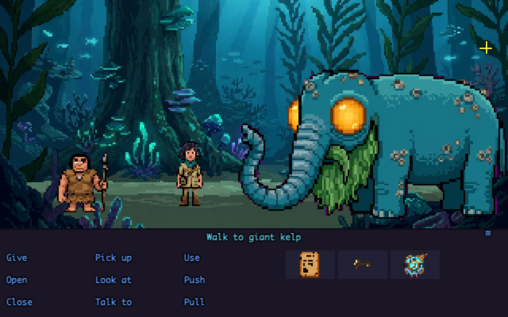 |
| The investigation hub | Interviewing a witness the size of a chapel |
| 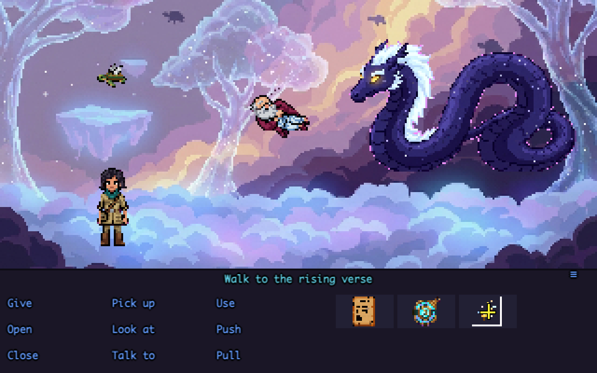 | 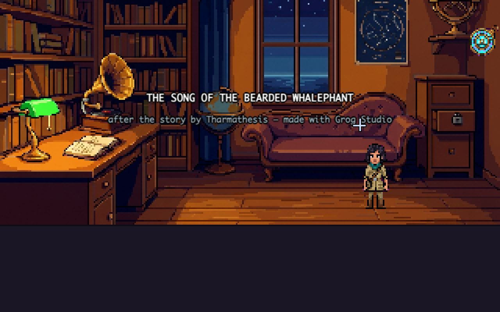 |
| The layer above | Case closed — gently |

## The engine, technically

320×200 native (integer-scaled, room viewport 320×144 — SCUMM's own layout),
DawnBringer-32 palette, classic 9-verb + sentence-line UI with two-noun verbs
(“Use rubber chicken with coolant tap”), right-click default verbs, walkable
polygons rasterized to a grid + A* + line-of-sight smoothing, y-based actor
scaling (walk to the horizon, become tiny), walk-behind baselines, scrolling
rooms with camera follow, hotspot states (closed/open/taken…), cutscene input
locking with click-to-skip, MI-style bottom-screen dialog trees with
`once`/condition gating, per-actor colored speech text, save/load (3 slots,
localStorage), F5 menu, pattern-sequenced chiptune music + procedural SFX.

Engine source: 7 files, ~2,300 lines total, no dependencies
(`engine/core.js render.js walk.js audio.js script.js ui.js boot.js`).

## The demo game

**Escape from the Engine Room** — QA tester **Deb Ugger** files bug #1337
(*“game engine eats QA tester”*) and is promptly eaten by the game engine. To
escape she must restart the Main Loop boiler, which demands three offerings:
**fuel** (grog — but grog dissolves mugs, so you'll need the rubber chicken with
a USB dongle in the middle), a **fresh frame** (sold by Sal, the certified
pre-owned asset salesman, for three artisanal pixels), and a **semicolon**
(win an insult sword-fight against the Dialog Tree: *“You fight like a QA
tester!”*). Featuring a legally distinct purple tentacle in a crate labeled
MISC VILLAIN, an Invisible Wall with tenure, retired save-point mushrooms who
are bitter about autosave, and a walk-behind column that cost three entire
lines of code and wants you to know it.

| | |
|---|---|
| 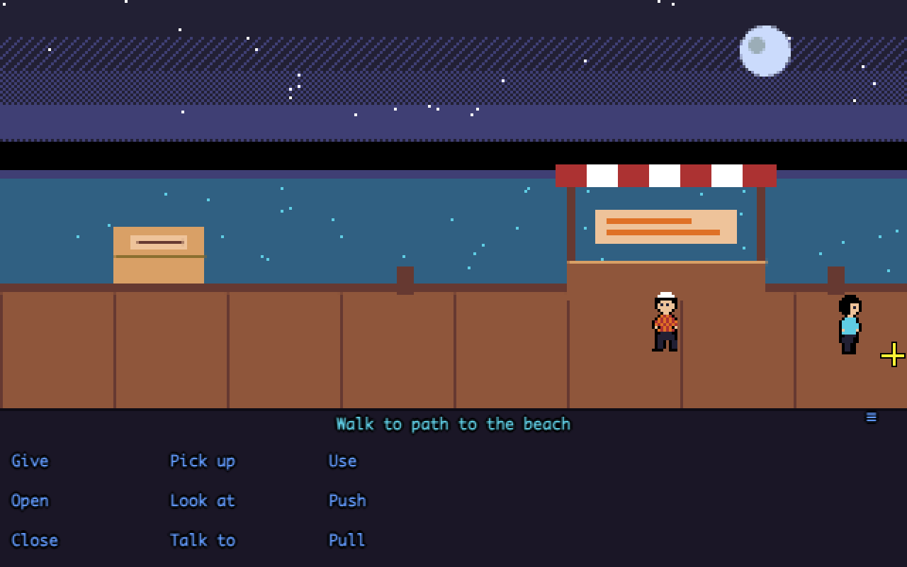 | 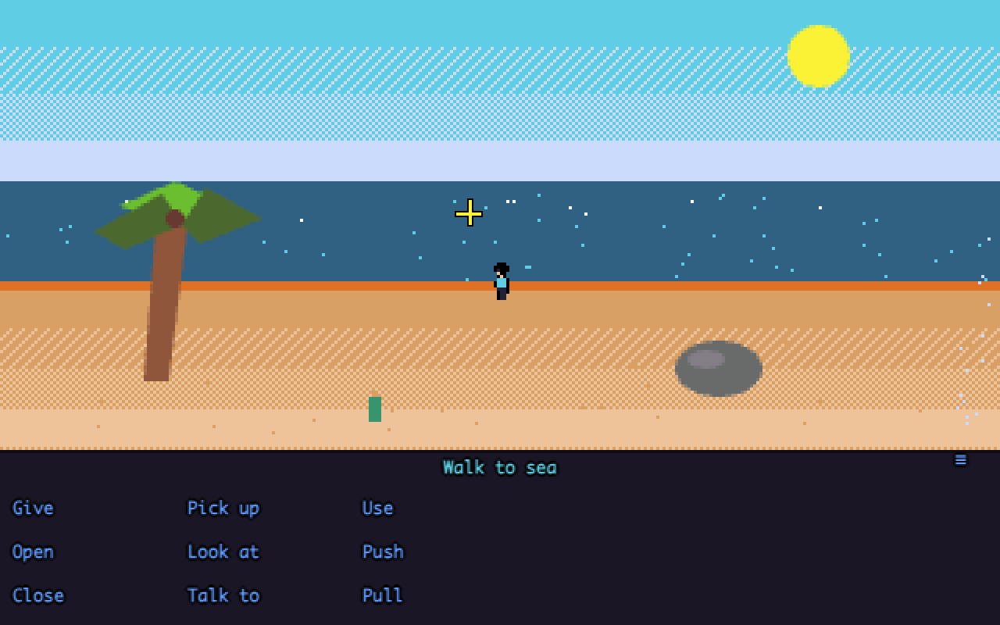 |
| Scrolling room, night palette | Scale band: walk to the horizon |
| 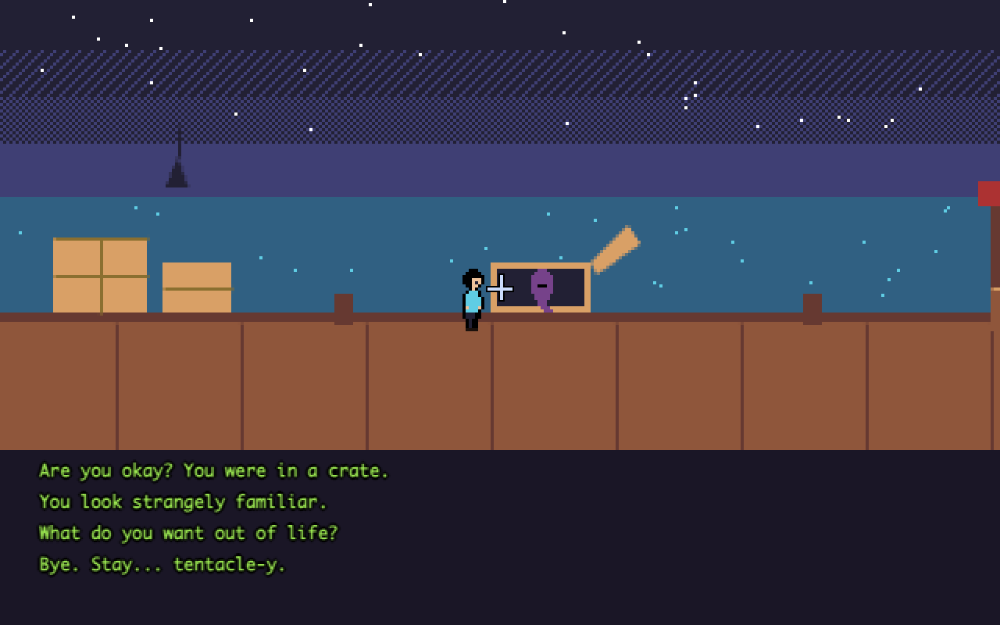 | 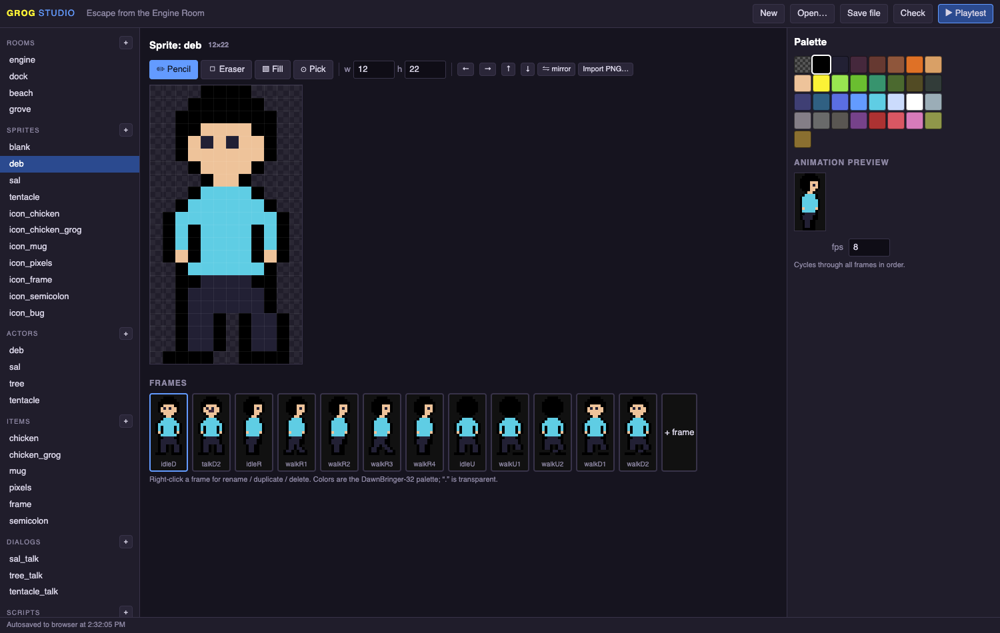 |
| Dialog trees, MI-style | Every art asset editable in Studio |

## Repository layout

```
engine/        the Grog runtime (7 files, no deps)
studio/        Grog Studio authoring app (no deps)
play.html      player shell (demo / ?project=url / Studio playtest host)
demo/          engine-room (drawn) · missing-pixel (assets) · whalephant (full asset game)
tools/         check-project.js — CLI project linter (node tools/check-project.js file)
docs/          ARCHITECTURE.md · AUTHORING.md · RESEARCH.md · screenshots
```

## Make your own game in 60 seconds

1. `python3 -m http.server 8000` → open http://localhost:8000/studio/
2. Start blank. Click **Rooms → room1**: draw hotspots, paint the background.
3. Click a hotspot → add a **look** handler → type a joke.
4. **▶ Playtest.** Laugh at your own joke.
5. **Export → Single-file HTML.** Upload to itch.io. You have shipped an adventure game.

Full guide: [docs/AUTHORING.md](docs/AUTHORING.md).

## License

MIT for the engine, the Studio, and the demo. Ship commercial games with it;
no fees, no version treadmill, no lawyers in crates.
